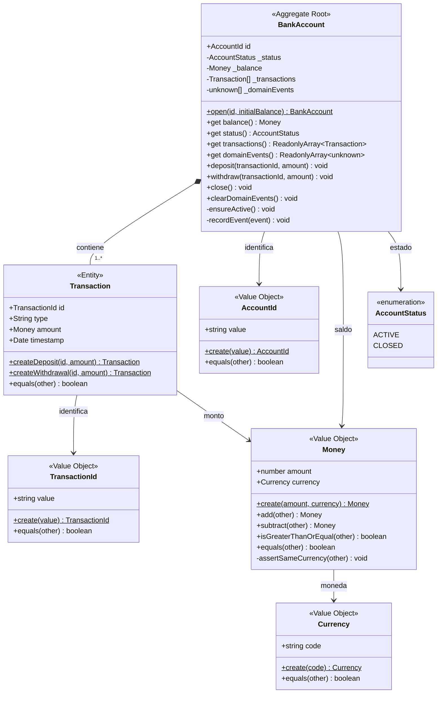

```mermaid
classDiagram
    direction TB

    class BankAccount {
        <<Aggregate Root>>
        +AccountId id
        -AccountStatus _status
        -Money _balance
        -Transaction[] _transactions
        -unknown[] _domainEvents
        +open(id, initialBalance)$ BankAccount
        +get balance() Money
        +get status() AccountStatus
        +get transactions() ReadonlyArray~Transaction~
        +get domainEvents() ReadonlyArray~unknown~
        +deposit(transactionId, amount) void
        +withdraw(transactionId, amount) void
        +close() void
        +clearDomainEvents() void
        -ensureActive() void
        -recordEvent(event) void
    }

    class Transaction {
        <<Entity>>
        +TransactionId id
        +String type
        +Money amount
        +Date timestamp
        +createDeposit(id, amount)$ Transaction
        +createWithdrawal(id, amount)$ Transaction
        +equals(other) boolean
    }

    class AccountId {
        <<Value Object>>
        +string value
        +create(value)$ AccountId
        +equals(other) boolean
    }

    class TransactionId {
        <<Value Object>>
        +string value
        +create(value)$ TransactionId
        +equals(other) boolean
    }

    class Money {
        <<Value Object>>
        +number amount
        +Currency currency
        +create(amount, currency)$ Money
        +add(other) Money
        +subtract(other) Money
        +isGreaterThanOrEqual(other) boolean
        +equals(other) boolean
        -assertSameCurrency(other) void
    }

    class Currency {
        <<Value Object>>
        +string code
        +create(code)$ Currency
        +equals(other) boolean
    }

    class AccountStatus {
        <<enumeration>>
        ACTIVE
        CLOSED
    }

    BankAccount *-- "1..*" Transaction : contiene
    BankAccount --> AccountId : identifica
    BankAccount --> Money : saldo
    BankAccount --> AccountStatus : estado
    Transaction --> TransactionId : identifica
    Transaction --> Money : monto
    Money --> Currency : moneda
```
