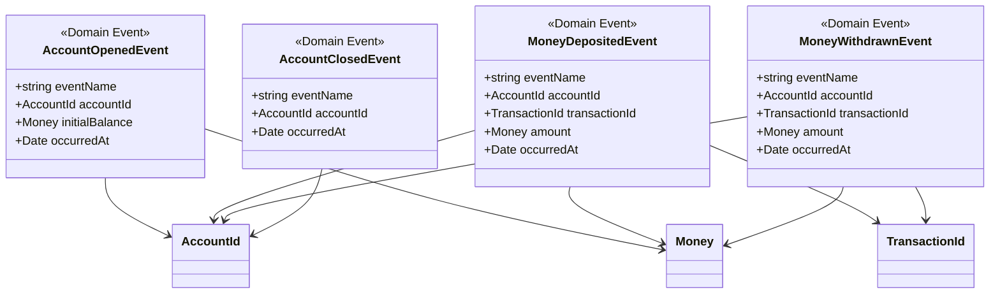

```mermaid
classDiagram
    direction TB

    class AccountOpenedEvent {
        <<Domain Event>>
        +string eventName
        +AccountId accountId
        +Money initialBalance
        +Date occurredAt
    }

    class MoneyDepositedEvent {
        <<Domain Event>>
        +string eventName
        +AccountId accountId
        +TransactionId transactionId
        +Money amount
        +Date occurredAt
    }

    class MoneyWithdrawnEvent {
        <<Domain Event>>
        +string eventName
        +AccountId accountId
        +TransactionId transactionId
        +Money amount
        +Date occurredAt
    }

    class AccountClosedEvent {
        <<Domain Event>>
        +string eventName
        +AccountId accountId
        +Date occurredAt
    }

    AccountOpenedEvent --> AccountId
    AccountOpenedEvent --> Money

    MoneyDepositedEvent --> AccountId
    MoneyDepositedEvent --> TransactionId
    MoneyDepositedEvent --> Money

    MoneyWithdrawnEvent --> AccountId
    MoneyWithdrawnEvent --> TransactionId
    MoneyWithdrawnEvent --> Money

    AccountClosedEvent --> AccountId
```
