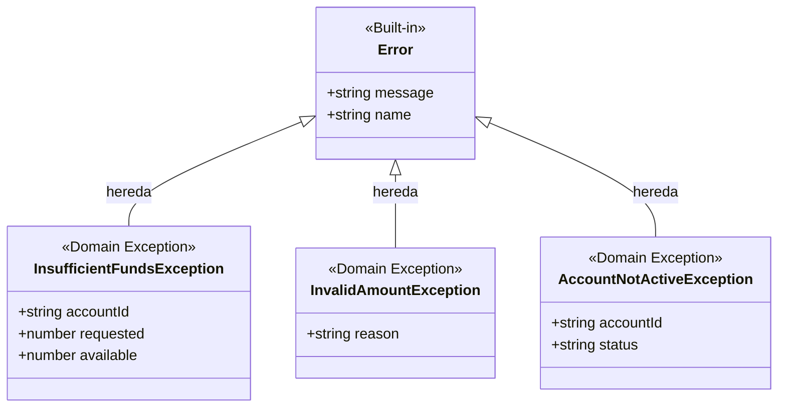

```mermaid
classDiagram
    direction TB

    class Error {
        <<Built-in>>
        +string message
        +string name
    }

    class InsufficientFundsException {
        <<Domain Exception>>
        +string accountId
        +number requested
        +number available
    }

    class InvalidAmountException {
        <<Domain Exception>>
        +string reason
    }

    class AccountNotActiveException {
        <<Domain Exception>>
        +string accountId
        +string status
    }

    Error <|-- InsufficientFundsException : hereda
    Error <|-- InvalidAmountException : hereda
    Error <|-- AccountNotActiveException : hereda
```
