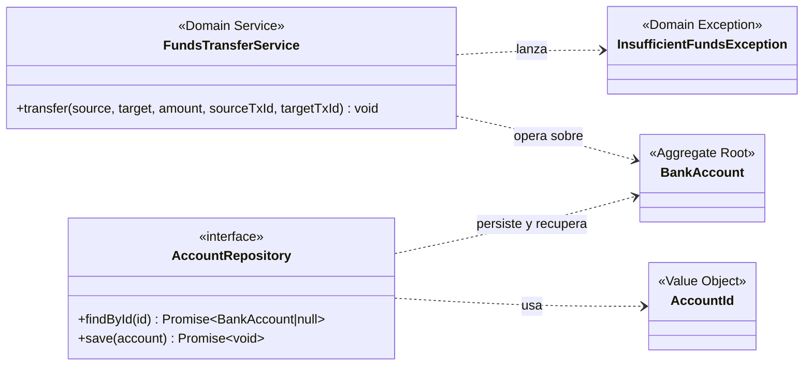

```mermaid
classDiagram
    direction LR

    class FundsTransferService {
        <<Domain Service>>
        +transfer(source, target, amount, sourceTxId, targetTxId) void
    }

    class AccountRepository {
        <<interface>>
        +findById(id) Promise~BankAccount|null~
        +save(account) Promise~void~
    }

    class BankAccount {
        <<Aggregate Root>>
    }

    class InsufficientFundsException {
        <<Domain Exception>>
    }

    class AccountId {
        <<Value Object>>
    }

    FundsTransferService ..> BankAccount : opera sobre
    FundsTransferService ..> InsufficientFundsException : lanza
    AccountRepository ..> AccountId : usa
    AccountRepository ..> BankAccount : persiste y recupera
```
